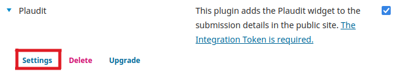
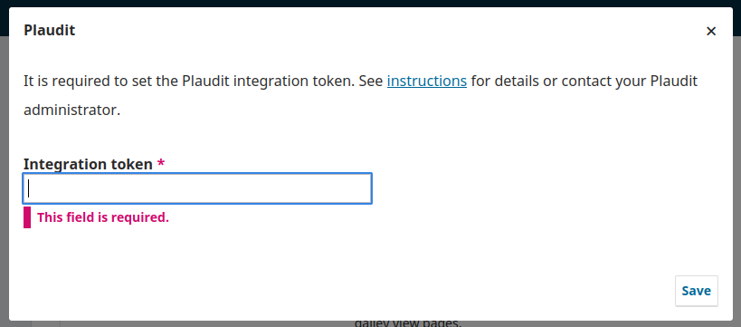
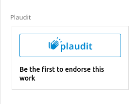

# Plaudit Plugin 

This plugin adds the [Plaudit](https://plaudit.pub/) widget to the submission details in the public site.

An integration token is required in order for the plugin to work properly. [See how to get one](#obtaining-an-integration-token)

## Compatibility

The latest release of this plugin is compatible with the following PKP applications:

* OPS 3.3.0
* OJS 3.3.0
* OMP 3.3.0

## Plugin Download

To download the plugin, go to the [Releases page](https://github.com/lepidus/plaudit/releases) and download the tar.gz package of the latest release compatible with your website.

## Installation

1. Enter the administration area of ​​your OJS/OPS website through the __Dashboard__.
2. Navigate to `Settings`>` Website`> `Plugins`> `Upload a new plugin`.
3. Under __Upload file__ select the file __plaudit.tar.gz__.
4. Click __Save__ and the plugin will be installed on your website.

## Configure your Plaudit integration token

1. After the plugin is installed and enabled, open the plugin settings:

    

2. In the indicated field, paste your Plaudit integration token, and save the form.
    
    

3. All good! You should see the Plaudit widget in the submissions details.

    

## Obtaining an integration token

If you dont have one already, you can folow the [Plaudit instructions on how to obtain it](https://plaudit.pub/integration):

*"To make sure Plaudit can handle the load, we are gradually rolling out integrations. Thus, at this point in time it is required to [contact us](mailto:integrate@plaudit.pub) if you are interested in integrating the Plaudit widget into your website. When your integration is approved, we will ask you for the host names you want to display the widget at (e.g. `example.com` and `dev.example.com`). You will then receive a token that can be used to integrate the widget at thost host names."*

* * *
# License
__This plugin is licensed under the GNU General Public License v3.0__

__Copyright (c) 2022 Lepidus Tecnologia__
